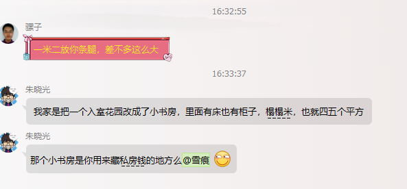

#谢谢

\[
e ^ {i\pi} + 1 =0
\]


# 一级标题

##二级标题

### 三级

#### 四级

| Name               | 阿哥     |
| ------------------ | -------- |
| 据了解奥兰多放假啦 | 阿斯蒂芬 |
|                    |          |
|                    |          |
|                    |          |
|                    |          |


| Name |
| ---- |
|      |
##### 五级


!


<!-- TOC depthFrom:1 depthTo:6 withLinks:1 updateOnSave:1 orderedList:0 -->

- [谢谢](#谢谢)
- [一级标题](#一级标题)
	- [二级标题](#二级标题)
		- [三级](#三级)
			- [四级](#四级)
				- [五级](#五级)
					- [六级](#六级)
					- [# 七级](#-七级)
					- [## 八级](#-八级)

<!-- /TOC -->


###### 六级

```java
class Test implements Serializable{
  public static void main(String[] args) {

  }
}
```

```html
<html>Say hello</html>
```


####### 七级


######## 八级

Q

A

S


S


D

D

D

D


D

D

D
